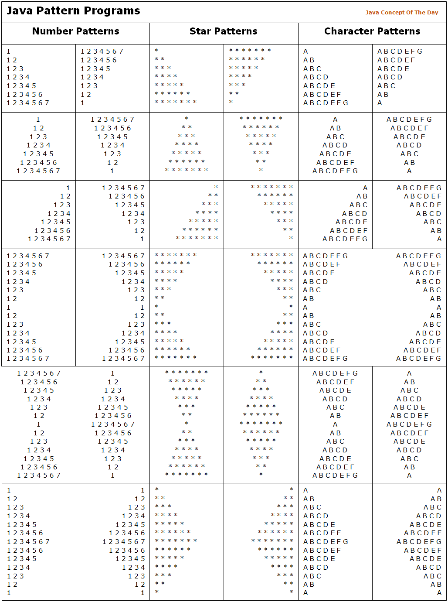

# 🧵 Python Pattern Practice

Welcome to **Python Pattern Practice**, a repository containing various **number**, **star**, and **character** pattern programs inspired by common coding interview questions and the classic Java pattern set.

This practice set includes over **40+ pattern problems** designed to improve your logic-building skills and understanding of **nested loops**, **string formatting**, and **control flow in Python**.

---



## 📂 Pattern Categories

Each category below contains multiple variations and levels of difficulty:

### 🔢 Number Patterns

| Pattern Type | Description |
|--------------|-------------|
| Ascending    | Print numbers from 1 to N increasing per line |
| Descending   | Reverse number sequences |
| Pyramid & Diamond | Indentation-based number patterns |

### ⭐ Star Patterns

| Pattern Type | Description |
|--------------|-------------|
| Left/Right Aligned | Triangle/star-based formation using spacing |
| Pyramid & Diamond | Symmetrical star shapes |
| Hollow Patterns | Advanced designs with spaces inside |

### 🔤 Character Patterns

| Pattern Type | Description |
|--------------|-------------|
| A to Z Printing | Row-wise alphabet sequences |
| Pyramids & Diamonds | Character-based pyramids |
| Reverse Patterns | Decreasing character width |

---

## 🚀 Getting Started

1. Clone the repository:
   ```bash
   https://github.com/chandanbcsm012/SimplePythonProgramPractice.git
   cd SimplePythonProgramPractice
   ```

2. Run any pattern:
   ```bash
   python pattern-1.py
   ```

---

## 🎯 Learning Objectives

- Improve logical thinking and nested loop mastery
- Practice Python string formatting
- Understand visual representations using loops

---

## 🛠️ Tools Used

- Python 3.8+
- VS Code / Any Python IDE

---

## 🤝 Contributions

Have your own pattern to add or want to optimize logic? Pull requests are welcome!

---

## 📸 Credits

Inspired by pattern exercises from **JavaConceptOfTheDay.com**.
